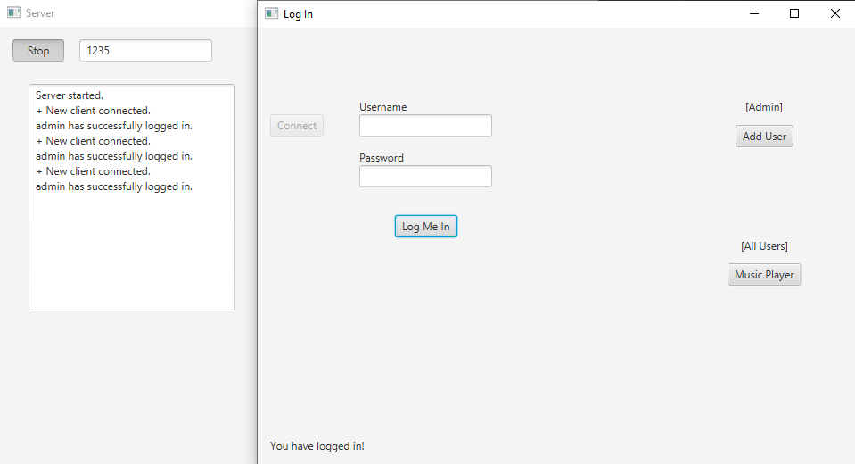
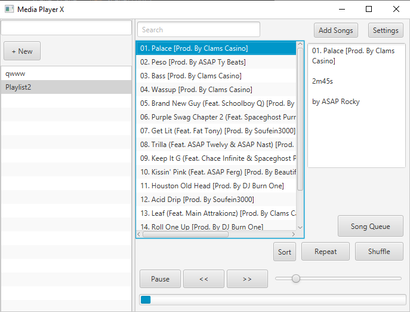

# Java Music Player 
**With IPC Socket login**

Client/server modules allows a connection to be established via sockets. Authentication is performed with hashes and a user login. 

All user accounts are able to access the music player. The only login is admin-admin.

